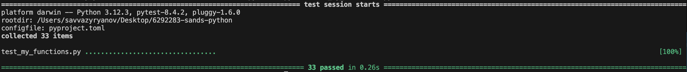
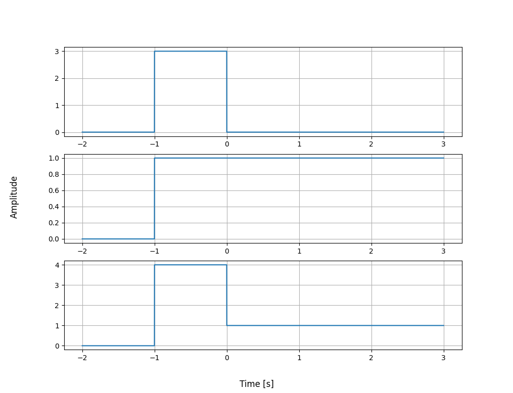

# Signals & Systems with Python

A Python repository for **generating, editing, combining and plotting** signals

---

## Features

- **Signal generators**: sine, cosine, unit step, rectangular pulse, (optionally) triangle, and helpers.
- **Modular math**: add, subtract, and scale signals element‑wise.
- **Time grid helpers**: consistent time arrays with a chosen `sample_rate` and `[start, end]` duration.
- **Plotting**: one‑liners to visualize one or multiple signals.
- **Test functions**: example tests with `pytest` to validate core behavior.

---

## Installation

```bash
# (Recommended) in a virtual environment
python -m venv .venv && source .venv/bin/activate  # on macOS/Linux
# .venv\Scripts\activate                            # on Windows PowerShell

pip install -e .
```

This installs the package in editable mode using the `pyproject.toml`, along with runtime dependencies (`numpy`, `matplotlib`).

---

## Repository structure

```
|─ signals.py                  # Core signal utilities (class + generators)
|─ run.py                      # Optional demo
|─ test_my_functions.py        # Example tests (pytest)
|─ README.md                   # You are here
|─ pyproject.toml              # Build + tooling configuration
```

---

## Quick start

```python
from signals import GenSigal, Signal

# 1) Define the common time window
gen = Gensignal(sample_rate=1000)       # samples per second
duration = [0, 2]          # seconds (start, end)

# 2) Make a few signals
s1 = gen.sine(duration, frequency=4, amp=1.0, phase=0.0)
c1 = gen.cosine(duration, frequency=8, amp=0.5, phase=0.0)
u  = gen.unit_step(duration, amp=2.0, displace=0.5)
p  = gen.pulse(duration, amp=1.5, displace=1.0)

# 3) Combine and plot
combo = s1 + 0.75*c1 + 0.5*u + p
plot_sig(t, combo, title="Combined signal")
```

**Important:** When combining signals, make sure they share the **same** `duration` and `sample_rate`.

---

## Current Features

### Time/grid helper

```python
_time(duration: list[float, float] | tuple[float, float] | float) -> np.ndarray
```
- Accepts `[start, end]`, `(start, end)`, or a scalar `end` (then `start=0`).
- Returns a 1‑D `numpy` time array.

### Generators

```python
sine(duration, frequency=1.0, amp=1.0, displace=0.0, sample_rate=1000)
cosine(duration, frequency=1.0, amp=1.0, displace=0.0, sample_rate=1000)
sinc(duration, frequency=1.0, amp=1.0, displace=0.0, sample_rate=1000)   
unit_step(duration, displace=0.0, amp=1.0, sample_rate=1000)
pulse(duration, amp=1.0, width=1.0, displace=0.0, sample_rate=1000)
triangle(duration, amp=1.0, displace=0.0, sample_rate=1000)      
ramp(duration, amp=1.0, displace=0.0, sample_rate=1000)         
```
All return `(t: np.ndarray, y: np.ndarray)`.

**Parameter conventions**
- `duration`: `[start, end]`/scalar `end` in seconds.
- `sample_rate`: samples/second (higher → smoother).
- `amp`: amplitude scale.
- `displace`: time shift (seconds); for non-sinusoids.
- `phase`: phase shift (seconds); for sinusoids.
- `frequency`: Hz for sinusoids.

---

### Signal functions
| Function | Explination |
| --- | :---: |
| `check_comp` | checks compatibility of two signals |
| `add` | adds two signals into one |
| `multiply` | multiplies two signals into one |
| `shift` | shifts signal a specified direction |
| `scale` | scales signal in time |
| `amplify` | scales signal in amplitude |
| `reverse` | reverses the signal in time |
| `convolution` | convolves two signals into one |
| `pad_signal` | pads a signal to be a specified duration by a specified amount |
| `add_to_plot` | adds a signal to a subplot and displays signals |


## Testing

This repo uses **pytest**.

```bash
pip install -e ".[dev]"
pytest -q
```



---

## Generate a Signal Example 1:

### Code
```python
from signals import GenSignal, Signal

gen = GenSignal(sample_rate=1000)
duration = [-2, 2]

sine = gen.sine(duration=duration)

sine.add_to_plot(fig_num=1, show=True)
```
### Result

 

## Generate a Signal Example 2:

 ### Code
 ```python
from signals import GenSignal, Signal

gen = GenSignal(sample_rate=1000)

sig1 = gen.pulse(duration=[-2,3], amp=3, displace=0.5)
sig2 = gen.unit_step(duration=[-2,3], amp=1, displace=1.0)
sigs_added = sig1.add(sig2)

sig1.add_to_plot(fig_num=1, show=False)
sig2.add_to_plot(fig_num=2, show=False)
sigs_added.add_to_plot(fig_num=3, show=True)
 ```
 ### Result
 

---

## Acknowledgements

Built for the TU Delft course **AESB2122 – Signals & Systems with Python**.
