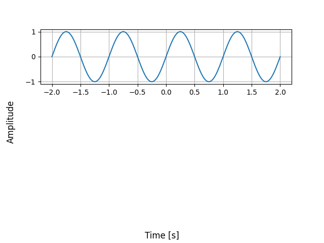

# A Python repository for creating and editing signals

## Current Features:

- Generators: sine, cosine (more to come)
- Editors: none (yet)
- Plotter: none (yet)

## Generate a Signal Example

### Code
```python
import matplotlib.pyplot as plt
from signals.gen_signals import create_sine_wave

t,sine = create_sine_wave(5,2,1000)

plt.plot(t,sine)
plt.grid(True)
plt.show()
```
### Result

 
