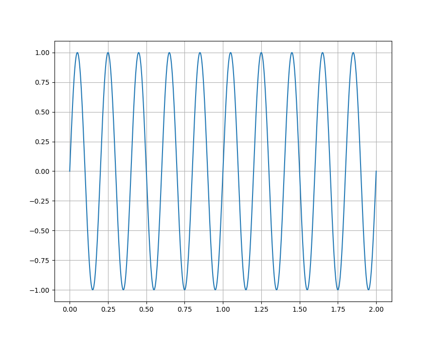
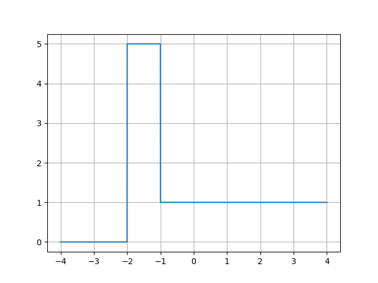

# A Python repository for creating and editing signals

## Current Features:

- Generators: sine, cosine (more to come)
- Editors: none (yet)
- Plotter: none (yet)

## How to use:
1. Install dependencies `numpy` and `matplotlib` with `-pip install`
2. Import `plot_sig` from `signals.plot_signals` (not required but convinent)
3. From `signals.gen_signals` import any function of choosing
4. Insert output into `plot_sig`

It is possible to add, subtract, multiple and divide different signals.

### **NOTE:** If conducting mathematical opererations, sample rate and duration *must* be the same for all signals used. Will not work otherwise.

## Function Parameters:

**All** generate functions have the parameters: 
- `duration` (duration of signal)
- `sample_rate` (how many samples taken. Less samples, choppier graph)
- `phase`/`displace` (functionally the same)
- `amp` (amplitude of signal)

`frequency` is a parameter **exclusive** to the `create_sine_wave` and `create_cosine_wave` functions

## Generate a Signal Example 1:

### Code
```python
from signals.gen_signals import create_sine_wave 
from signals.plot_signal import plot_sig

duration = [0,2] #D uration of signal
frequency = 4

t,sine = create_sine_wave(duration, frequency)
# Returns time and signal values to plot

plot_sig(t,sine) # Plots signal
```
### Result

 

## Generate a Signal Example 2:

 ### Code
 ```python
from signals.gen_signals import create_pulse, create_unit_step
from signals.plot_signal import plot_sig

duration = [-4,4]

t, step = create_unit_step(duration, displace=2) # Moves signal 2 units left
t, pulse = create_pulse(duration, amp=4, displace=-1.5) 

plot_sig(t,step+pulse)
 ```
 ### Result
 

